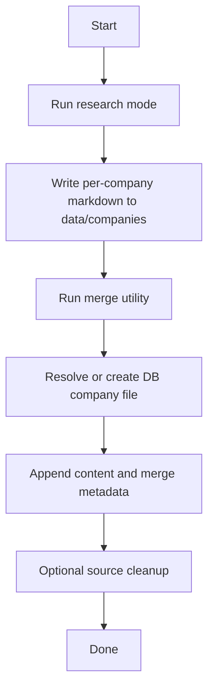
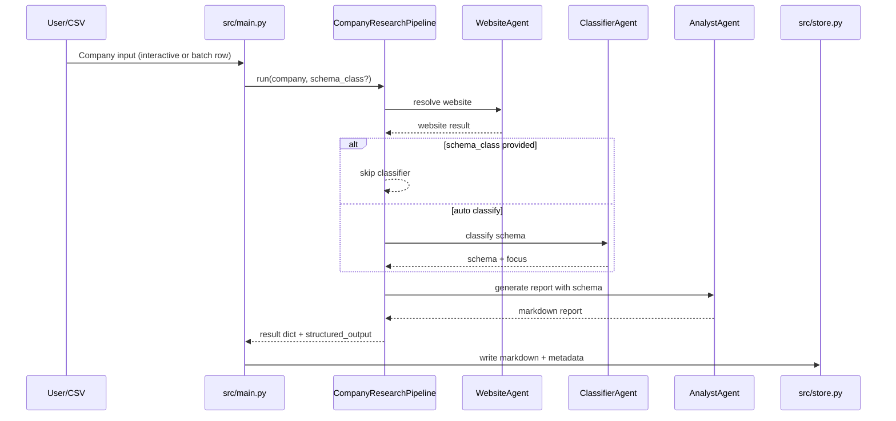
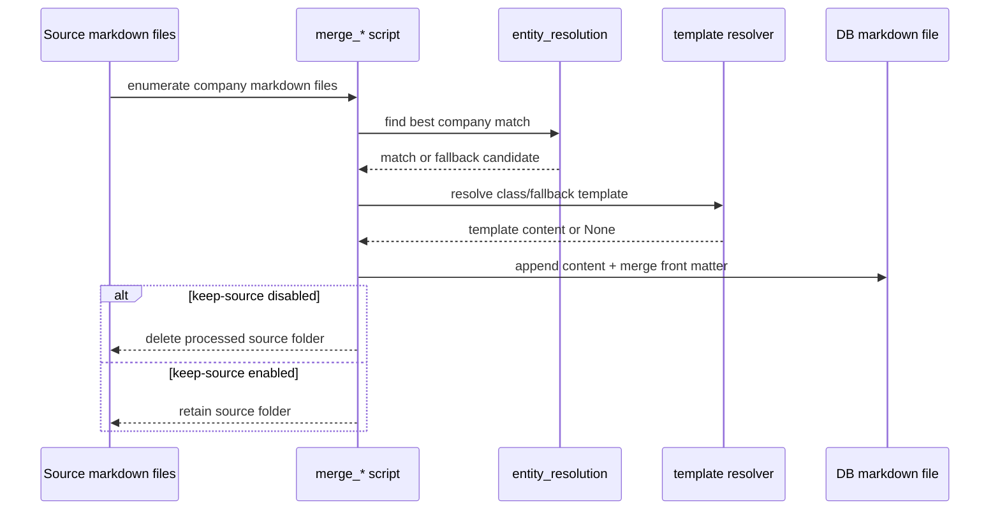
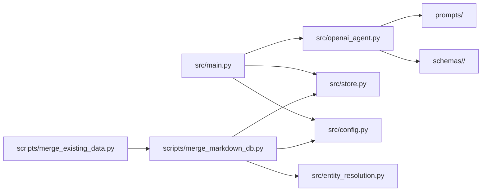

# Architecture Guide

This document explains the repository’s execution flow, module responsibilities, and key data transformations.

## 1) High-Level Flow

The system has two phases:

1. **Research**: Generate per-company markdown reports in `data/companies/<Company>/markdown/`
2. **Merge**: Consolidate those reports into one markdown DB entry per company

### Visual flow (research + merge)



### Research phase sequence

1. `src/main.py` selects interactive or batch mode.
2. `CompanyResearchPipeline` (in `src/openai_agent.py`) runs:
   - `WebsiteAgent`
   - `ClassifierAgent` (unless schema is provided)
   - `AnalystAgent`
3. `src/main.py::_save_report()` normalizes metadata and writes markdown via `src/store.py`.
4. Optional metadata prompts append/merge values in saved files.

### Research sequence diagram



### Merge phase sequence

1. Merge script scans source company folders.
2. Company identity is matched against DB entries.
3. Destination file is selected or created.
4. Template is resolved (`schema template` -> `fallback template`).
5. Source markdown is appended and metadata is merged.
6. Source company folder is removed (unless keep-source flag is used).

### Merge sequence diagram



## 2) Module Responsibilities

### Component interaction map



## `src/main.py`

Primary CLI orchestration and user interactions.

Key responsibilities:
- Prompting user in interactive mode
- Reading CSV in batch mode
- Calling pipeline and handling errors
- Saving reports with metadata
- Triggering merge script

Notable helpers:
- `_extract_ai_report_field_lines()` extracts inline `website:` / `firm type:` from report body
- `_resolve_ai_focus()` determines focus using classifier output or schema fallback
- `_save_report()` writes markdown and applies optional metadata updates

## `src/openai_agent.py`

AI pipeline and data collection layer.

Key components:
- `WebsiteAgent`: website discovery
- `ClassifierAgent`: schema selection
- `AnalystAgent`: report generation
- `CompanyResearchPipeline`: end-to-end orchestrator
- `CompanyResearchOutput`: structured return model

Important internal logic:
- API key resolution supports config, env vars, dotenv, and Windows registry fallback
- Schema discovery supports directory-based schemas and legacy flat files
- Website content collection includes homepage + internal subpages

## `src/store.py`

Persistence and metadata normalization.

Key responsibilities:
- Safe folder/file naming
- Company directory layout creation
- Front matter write/update operations
- List-like metadata normalization and append behavior

Normalization behavior:
- Comma-separated metadata can become lists
- Existing list fields are appended without case-insensitive duplicates

## `src/config.py`

Configuration and storage path resolution.

Key responsibilities:
- Load `config.yaml`
- Safely handle missing/invalid config
- Resolve source/database directories from config + CLI overrides

## `src/entity_resolution.py`

Company-name matching logic used by merge flows.

Behavior:
- Uses probabilistic matching when optional dependencies are available
- Falls back to deterministic similarity matching when they are not

## `scripts/merge_markdown_db.py`

Interactive merge utility.

Key responsibilities:
- Walk source company markdown folders
- Resolve candidate DB match or create new destination file
- Merge metadata and append source content
- Handle template-driven insertion for new files

## `scripts/merge_existing_data.py`

Merge-only utility for already-collected markdown content.

Key responsibilities:
- Reuse merge logic from `merge_markdown_db.py`
- Support source cleanup toggle (`--keep-merged-source`)

## 3) Data and Directory Model

## Source research output

- Root: `data/companies/`
- Per company:
  - `raw_html/`
  - `markdown/`
  - `pdf/`
  - `assets/`

Research markdown includes YAML front matter with fields such as:
- `website`
- `date`
- `focus`
- `firm_type`
- `source`
- `schema`
- optional `prop_type`, `loan_type`

## Database output

- Root: `storage.database_dir`
- One markdown file per company

## 4) Schema and Prompt Model

## Prompts

Editable prompts live in `prompts/`:
- `website_agent.md`
- `classifier_agent.md`
- `analyst_agent.md`

## Schema classes

Each schema class lives under `schemas/<class>/`:
- `extraction.md`: extraction scope
- `output.md`: output shape
- `template.md`: DB template for new company files

## 5) Execution Contracts

## Pipeline input/output contract

`CompanyResearchPipeline.run(company_name, schema_class=None)` returns a dict containing:
- `company`
- `website`
- `schema`
- `report`
- `website_agent`
- `classifier_agent`
- `structured_output`

## Merge contract

Merge scripts expect source markdown under:
- `<source_dir>/<Company>/markdown/*.md`

Destination DB file is selected by match logic or created from user choice.

## 6) Error and Fallback Strategy

- AI initialization errors are surfaced clearly at startup.
- Website fetch/parsing failures return safe placeholder text instead of crashing the full run.
- Batch mode supports continue-on-error behavior.
- Entity matching has deterministic fallback if optional matching dependencies are missing.

## 7) Test Coverage Map

Main suite is under `tests/` and covers:
- pipeline flow
- metadata behavior
- merge behavior
- config path resolution
- entity resolution behavior

Run:

```bash
python -m pytest -q
```

## 8) Decision Log (Tradeoffs and Rationale)

### 8.1 Metadata list normalization

Decision:
- Treat key metadata fields (`focus`, `firm_type`, `source`) as list-like values in storage, even when a single value is present.

Rationale:
- Avoids type drift between single-value and multi-value runs.
- Simplifies merge/update logic and reduces edge-case branching.

Tradeoff:
- Some outputs may appear more verbose (`["Value"]` instead of `"Value"`).

### 8.2 Schema class explicit override

Decision:
- If `schema_class` is provided by user/CSV, skip classifier inference.

Rationale:
- Makes batch behavior deterministic and user-controlled.
- Prevents accidental class drift for known pipelines.

Tradeoff:
- A wrong explicit schema can reduce report quality versus auto-classification.

### 8.3 Dual matching strategy in merge flows

Decision:
- Use probabilistic/entity-linkage matching when optional dependencies are installed; fall back to deterministic similarity when unavailable.

Rationale:
- Keeps advanced matching quality where supported.
- Preserves portability and non-breaking behavior in minimal environments.

Tradeoff:
- Match confidence and ranking can differ across environments.

### 8.4 Source folder cleanup after merge

Decision:
- Default merge behavior removes processed source folders, with opt-out flag (`--keep-merged-source`) in merge-only flow.

Rationale:
- Prevents duplicate re-merges in repeated runs.
- Keeps source area clean after successful consolidation.

Tradeoff:
- Requires explicit keep-source usage when retaining raw source snapshots is desired.

### 8.5 Config path resolution rules

Decision:
- Resolve relative storage paths from config location and keep source directory rooted at `data/companies` unless explicitly overridden.

Rationale:
- Improves portability across machines and avoids accidental writes to ambiguous CWD paths.

Tradeoff:
- Existing workflows that relied on legacy implicit paths may need config updates.
